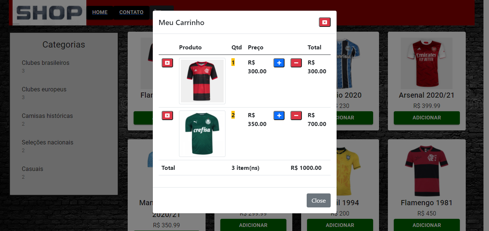

# CART SHOPPING

This is my project: Cart Shopping from [DIO](https://web.dio.me)

## Table of contents

- [Overview](#overview)
  - [The project](#the-project)
  - [Features](#features)
  - [Preview](#preview)
  - [Demo](#demo)
- [Process](#process)
  - [Built with](#built-with)
- [Author](#author)

## Overview

### The project

A online store created with React.Js.

### Features

- Products ordered by category
- Cart system with Local Storage
- Add and remove products

### Preview

### Demo

https://cartshoppingsystem.netlify.app

## Process

### Built with

- [React.Js](https://en.reactjs.org)
- [material ui](https://mui.com)
- [prop-types](https://www.npmjs.com/package/prop-types)

## Author

- [Portfolio](https://ruanheleno.github.io)
- [LinkedIn](https://www.linkedin.com/in/ruanheleno/)