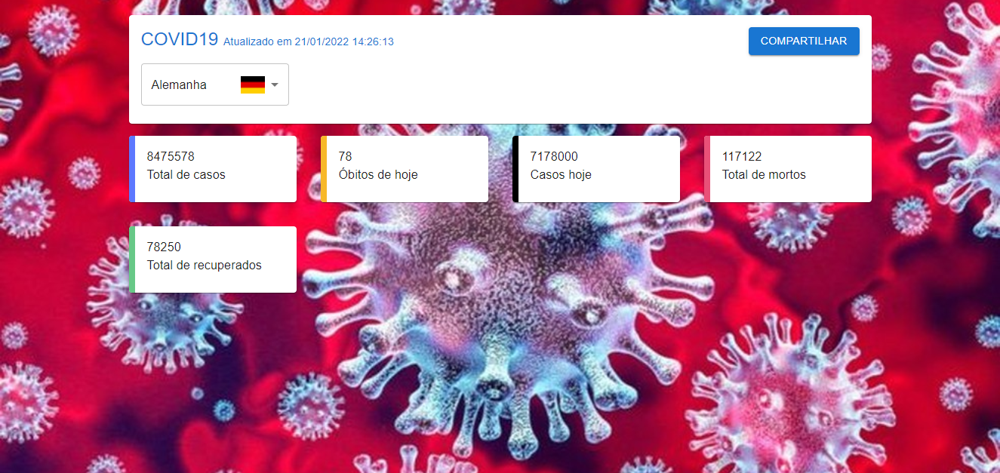

# COVID19 PWA

This is my project: Covid19 PWA from [DIO](https://web.dio.me)

## Table of contents

- [Overview](#overview)
  - [The project](#the-project)
  - [Features](#features)
  - [Preview](#preview)
  - [Demo](#demo)
- [Process](#process)
  - [Built with](#built-with)
- [Author](#author)

## Overview

### The project

System to know some datas related to Covid19 consuming an API.

### Features

- Find some datas about covid19, like: Today Deaths, Total Recovered, Total Deaths, etc.

### Preview

### Demo

https://covid19inworld.netlify.app

## Process

### Built with

- [React.Js](https://en.reactjs.org)
- [material ui](https://mui.com)
- [prop-types](https://www.npmjs.com/package/prop-types)

## Author

- [Portfolio](https://ruanheleno.github.io)
- [LinkedIn](https://www.linkedin.com/in/ruanheleno/)