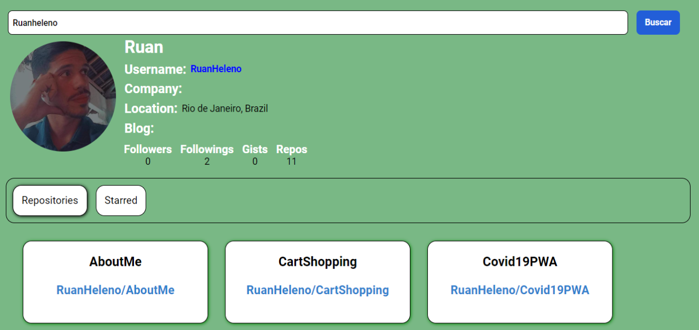

# Github Search Profile

This is my project: Github Search Profile from [DIO](https://web.dio.me)

## Table of contents

- [Overview](#overview)
  - [The project](#the-project)
  - [Features](#features)
  - [Preview](#preview)
  - [Demo](#demo)
- [Process](#process)
  - [Built with](#built-with)
- [Author](#author)

## Overview

### The project

- Github Search Profile 

### Features

- Search infos by username
- Search repo by username
- Search starred by username

### Preview

### Demo

[GithubSearchProfile](https://githubsearchprofiles.netlify.app)

## Process

### Built with

- [React.Js](https://en.reactjs.org)
- [axios](https://www.npmjs.com/package/axios)
- [react-tabs](https://www.npmjs.com/package/react-tabs)
- [styled-components](https://styled-components.com/)

## Author

- [Portfolio](https://ruanheleno.github.io)
- [LinkedIn](https://www.linkedin.com/in/ruanheleno/)