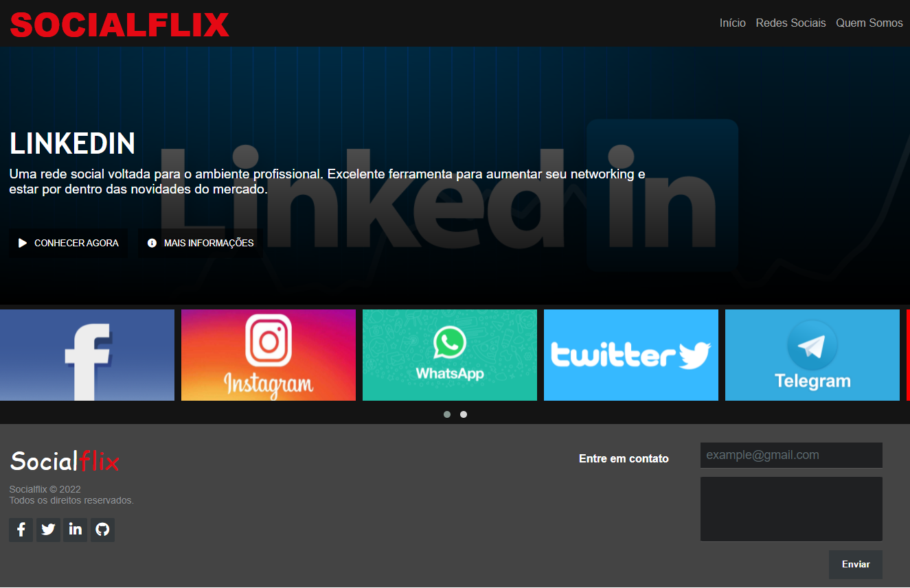

# NETFLIX CLONE

This is my project [SOCIALFLIX](https://socialflix.netlify.app)

## Table of contents

- [Overview](#overview)
  - [The project](#the-project)
  - [Screenshot](#screenshot)
- [Process](#Process)
  - [Built with](#built-with)
- [Author](#author)

## Overview

### The project

- Create a Netflix FrontEnd Clone with HTML5, CSS3 and Javascript

### Screenshot

## Process

### Built with

- [HTML5](https://www.w3schools.com/html/)
- [CSS3](https://developer.mozilla.org/pt-BR/docs/Web/CSS)
- [Javascript](https://www.javascript.com)

## Author

- [Portfolio](https://ruanheleno.github.io)
- [LinkedIn](https://www.linkedin.com/in/ruanheleno/)