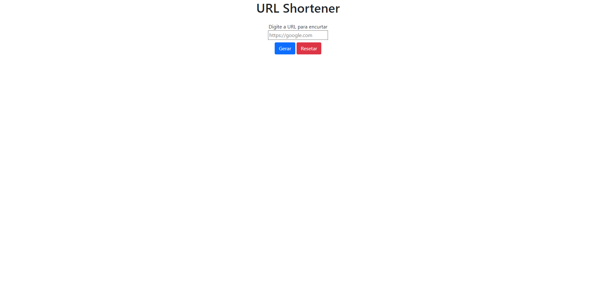

# URL SHORTENER

This is my project to the [URL SHORTENER from DIO](https://web.dio.me/project/construindo-encurtador-de-url). 

## Table of contents

- [Overview](#overview)
  - [The project](#the-project)
  - [Screenshot](#screenshot)
- [Process](#Process)
  - [Built with](#built-with)
- [Get Started](#get-started)
  - [Basic Commands](#basic-commands)
  - [Production](#production)
- [Author](#author)

## Overview

### The project

- Create a URL Shortener with Node.js, Typescript and MongoDB

### Screenshot

## Process

### Built with

- [HTML5](https://www.w3schools.com/html/)
- [Bootstrap5](https://getbootstrap.com)
- [Typescript](https://www.typescriptlang.org)
- [Node.Js](https://nodejs.org/en/)
- [SASS](https://sass-lang.com)
- [Gulp](https://gulpjs.com)

## Get Started

### Basic commands

- Run command ``npm run build:watch`` to verify and update changes in index.ts
- Run command ``npm run dev`` to start nodemon 

### Production

- Run command ``gulp sass`` to one time update HTML and CSS in dist folder
- Run command ``gulp`` to watching updates in real time codding and change in HTML and CSS in dist folder

## Author

- [Portfolio](https://ruanheleno.github.io)
- [LinkedIn](https://www.linkedin.com/in/ruanheleno/)
